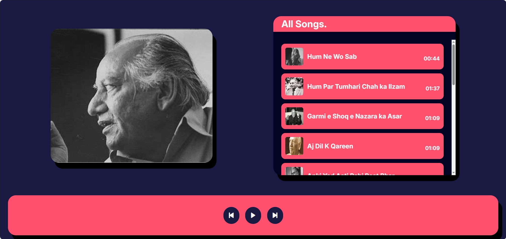

# Faiz Ahmed Faiz Recital (Poetries Recited By Faiz Ahmed Faiz)

This is an audio player which plays poetries recited by Renowned Urdu Poet Faiz Ahmed Faiz.

## Table of contents

- [Overview](#overview)
  - [Screenshot](#screenshot)
  - [Links](#links)
- [My process](#my-process)
  - [Built with](#built-with)
  - [What I learned](#what-i-learned)

## Overview

This website is for web broswer only.

### Screenshot

### Links

- Live Site URL: [Live Site](https://asimsaeed353.github.io/faiz-recitals-audio-player/)

## My process

### Built with

- Semantic HTML5 markup
- CSS custom properties
- Flexbox
- CSS Grid
- JavaScript

### What I learned

This project improved my learning of using JavaScript to manipulate DOM, adding functionalities of audio. I was also able to revise my concepts leverging CSS properties to design simple interface.
